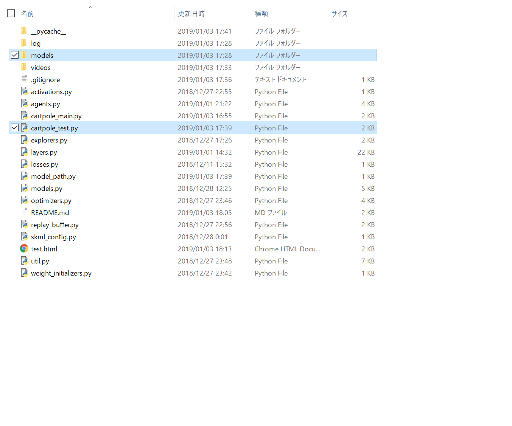
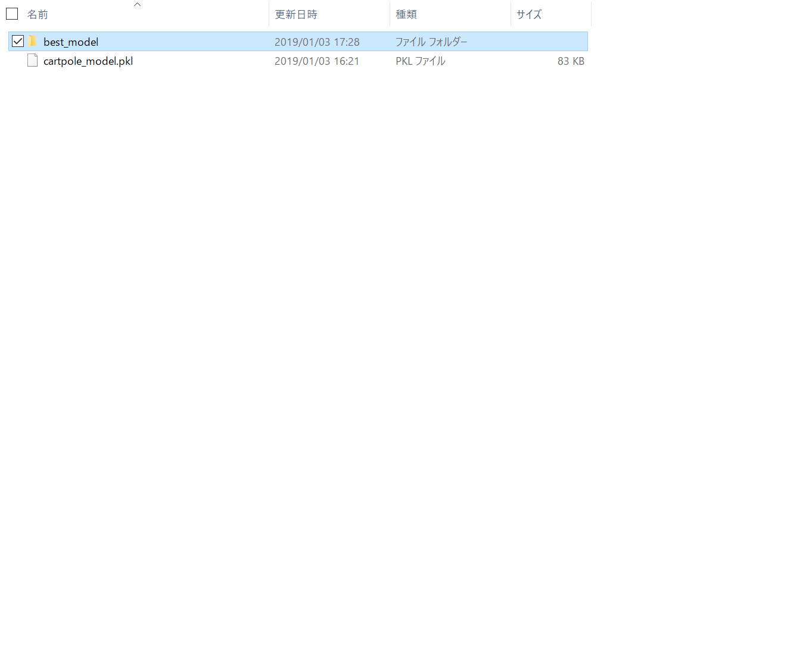
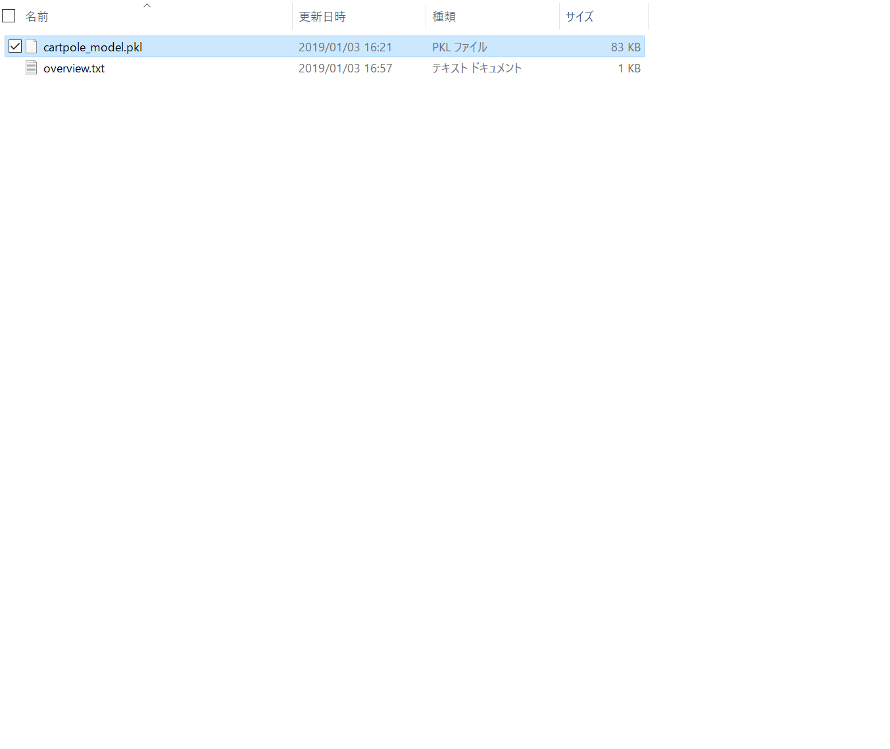
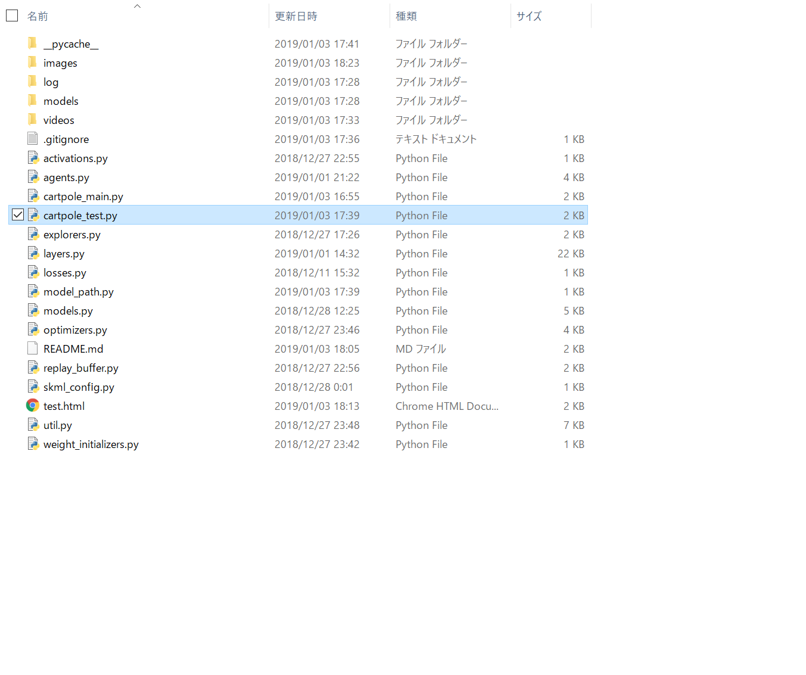

<h1>自作の機械学習ライブラリで強化学習を行いました。</h1>
 
<h2>環境: Open AI Gym (CartPole)</h2>
 

DQN, ExperienceReplayなどの技術を用いて約40分間学習させました。

cartpole_main.pyを実行することで実際に学習を行い、学習途中のログを確認することができます。

cartpole_test.pyと同じ階層にmodels/best_model/cartpole_model.pklとフォルダ・ファイルを作り実行することで、モデルを試すことができます。

容量の関係でgithubにはmodelファイルは置いていませんが、以下のリンクからダウンロードしていただくことが可能です。

 

以下に今回の学習によって得られた各ファイルへのリンクを示します。

 

<a href="https://drive.google.com/drive/folders/1KpIJzAR9y2GweXMRbbPOZx7DXVzWqMHd?usp=sharing">学習時に出力されたログ</a>

学習が進むごとに長い時間棒を立てた状態を維持できていることがわかります。

 

<a href="https://drive.google.com/drive/folders/1ZvUbr0Roo7vgKc7CR_LcsXlZRUGGhUOz?usp=sharing">学習済みのモデル</a>

自作ライブラリの学習済みモデルです。

cartpole_test.pyと同じ階層にmodels/best_model/cartpole_model.pklとフォルダ・ファイルを作ることでモデルを試すことができます。

以下にモデルを試す方法を視覚的に示します。

cartpole_test.pyと同じ階層にmodelsフォルダを置きます。

modelsフォルダの下に、best_modelフォルダを置きます。

best_modelフォルダの下に、cartpole_model.pklを置きます。

今回学習させたモデルは<a href="https://drive.google.com/file/d/1-XzOqSUWn3CORL8oC0w-9LVNN_k7JPGS/view?usp=sharing">こちら</a>からダウンロードしていただくことが可能です。

最後に、cartpole_test.pyを実行します。

 

<a href="https://drive.google.com/drive/folders/1Uot_jluqqfir-RdftLyyFrW_78hdRNxi?usp=sharing">学習過程の動画</a>

100エピソードごとに保存した、学習過程の動画です。

棒を倒してしまった時点で、動画は終了します。

エピソードが進むごとに長い時間棒を立てた状態を維持できているのが視覚的に確認できます。
